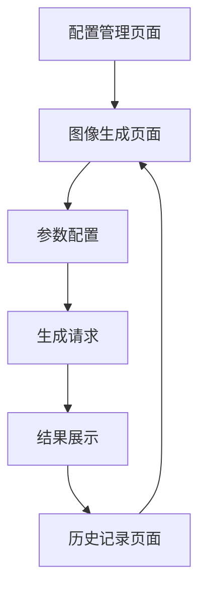

# 通义万相文生图MCP服务器产品需求文档

## 1. Product Overview
基于阿里云百炼通义万相文生图V2版API的MCP（Model Context Protocol）服务器，为用户提供文本到图像生成服务。
- 解决问题：为开发者和应用提供标准化的文生图API接口，简化图像生成集成流程
- 目标用户：需要集成AI图像生成功能的开发者、应用程序和AI助手
- 产品价值：提供高质量的中文文生图能力，支持多种风格和尺寸配置

## 2. Core Features

### 2.1 Feature Module
我们的MCP服务器包含以下核心页面：
1. **配置管理页面**：API密钥配置、服务参数设置
2. **图像生成页面**：文本输入、参数配置、图像生成和预览
3. **历史记录页面**：生成历史查看、图像管理

### 2.2 Page Details

| Page Name | Module Name | Feature description |
|-----------|-------------|---------------------|
| 配置管理页面 | API配置模块 | 设置阿里云API Key、选择服务区域、配置默认参数 |
| 配置管理页面 | 参数预设模块 | 创建和管理常用的生成参数预设，包括尺寸、风格等 |
| 图像生成页面 | 文本输入模块 | 输入文本描述，支持中英文，提供提示词优化建议 |
| 图像生成页面 | 参数配置模块 | 设置图像尺寸、风格、质量等参数，实时预览配置效果 |
| 图像生成页面 | 生成控制模块 | 发起生成请求、显示进度、处理错误、展示结果 |
| 历史记录页面 | 记录列表模块 | 显示生成历史、支持搜索和筛选、批量操作 |
| 历史记录页面 | 图像管理模块 | 图像预览、下载、删除、分享功能 |

## 3. Core Process

**主要用户操作流程：**
1. 用户首次使用需要在配置页面设置阿里云API密钥
2. 在图像生成页面输入文本描述
3. 选择或自定义生成参数（尺寸、风格等）
4. 点击生成按钮，系统调用阿里云API
5. 显示生成进度，完成后展示图像结果
6. 用户可以下载图像或查看历史记录

## 4. User Interface Design

### 4.1 Design Style
- 主色调：#1890FF（蓝色），辅助色：#52C41A（绿色）
- 按钮风格：圆角矩形，悬停效果，阴影设计
- 字体：系统默认字体，标题16px，正文14px，说明文字12px
- 布局风格：卡片式布局，左侧导航，响应式设计
- 图标风格：线性图标，统一风格，支持深色模式

### 4.2 Page Design Overview

| Page Name | Module Name | UI Elements |
|-----------|-------------|-------------|
| 配置管理页面 | API配置模块 | 表单输入框、密钥显示/隐藏切换、连接测试按钮、状态指示器 |
| 配置管理页面 | 参数预设模块 | 预设卡片列表、新建/编辑弹窗、参数滑块和选择器 |
| 图像生成页面 | 文本输入模块 | 多行文本框、字符计数、提示词建议下拉列表 |
| 图像生成页面 | 参数配置模块 | 参数面板、实时预览、重置按钮、预设快速选择 |
| 图像生成页面 | 生成控制模块 | 生成按钮、进度条、错误提示、结果图像展示区 |
| 历史记录页面 | 记录列表模块 | 表格视图、搜索框、日期筛选器、分页组件 |
| 历史记录页面 | 图像管理模块 | 图像网格布局、悬浮操作按钮、预览模态框 |

### 4.3 Responsiveness
桌面优先设计，支持移动端自适应，针对触摸操作优化按钮大小和间距。