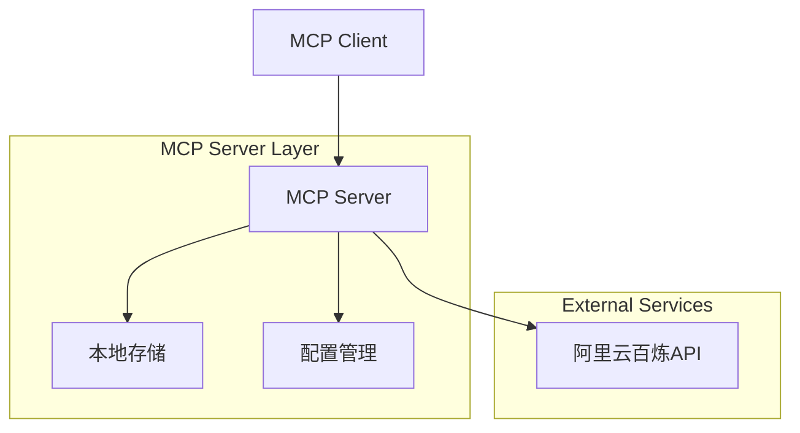
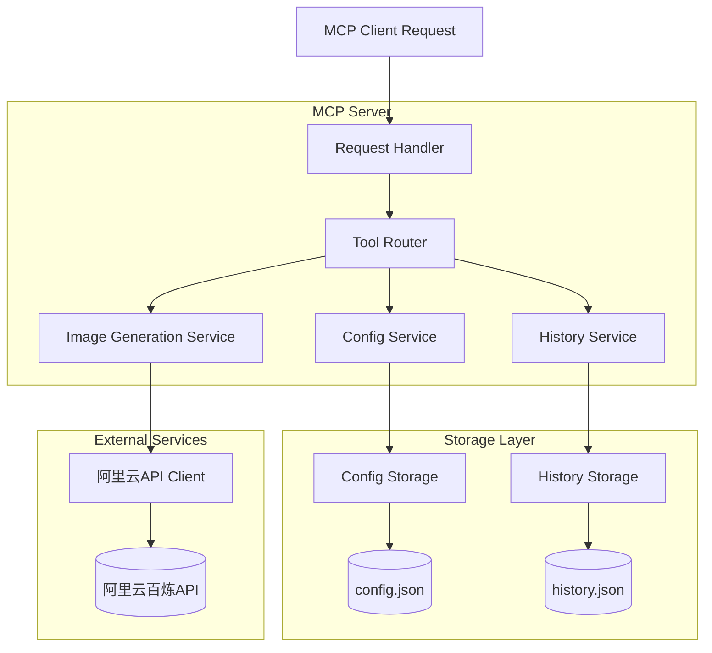
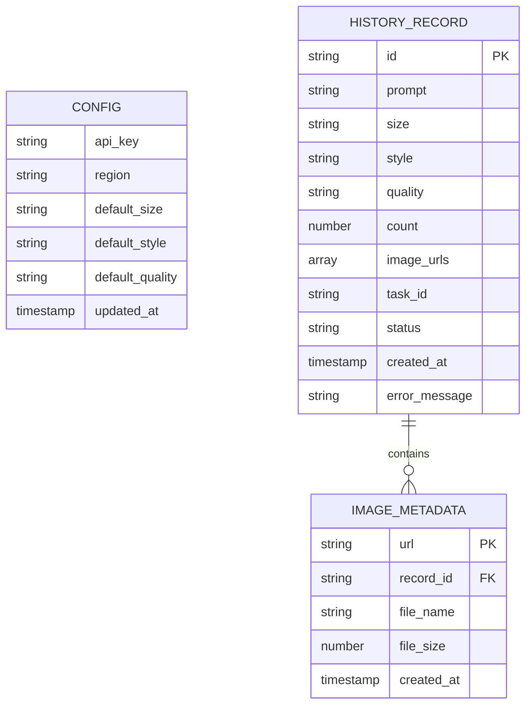

# 通义万相文生图MCP服务器技术架构文档

## 1. Architecture design



## 2. Technology Description

* Frontend: 无（MCP协议服务器）

* Backend: Node.js + TypeScript + MCP SDK

* Storage: 本地文件系统（配置和历史记录）

* External API: 阿里云百炼通义万相API

## 3. Route definitions

| Route                 | Purpose             |
| --------------------- | ------------------- |
| /tools/generate-image | 文生图工具接口，接收文本和参数生成图像 |
| /tools/list-history   | 获取生成历史记录列表          |
| /tools/get-config     | 获取当前配置信息            |
| /tools/set-config     | 设置API密钥和默认参数        |

## 4. API definitions

### 4.1 Core API

**文生图生成接口**

```
TOOL: generate-image
```

Request:

| Param Name | Param Type | isRequired | Description                 |
| ---------- | ---------- | ---------- | --------------------------- |
| prompt     | string     | true       | 文本描述，支持中英文                  |
| size       | string     | false      | 图像尺寸，默认"1024\*1024"         |
| style      | string     | false      | 图像风格，如"photography"、"anime" |
| quality    | string     | false      | 图像质量，"standard"或"hd"        |
| n          | number     | false      | 生成图像数量，默认1                  |

Response:

| Param Name | Param Type | Description |
| ---------- | ---------- | ----------- |
| success    | boolean    | 生成是否成功      |
| images     | array      | 生成的图像URL列表  |
| task\_id   | string     | 任务ID        |
| error      | string     | 错误信息（如果有）   |

Example Request:

```json
{
  "prompt": "一只可爱的小猫在花园里玩耍",
  "size": "1024*1024",
  "style": "photography",
  "quality": "hd",
  "n": 1
}
```

**配置管理接口**

```
TOOL: set-config
```

Request:

| Param Name     | Param Type | isRequired | Description         |
| -------------- | ---------- | ---------- | ------------------- |
| api\_key       | string     | true       | 阿里云API密钥            |
| region         | string     | false      | 服务区域，默认"cn-beijing" |
| default\_size  | string     | false      | 默认图像尺寸              |
| default\_style | string     | false      | 默认图像风格              |

**历史记录接口**

```
TOOL: list-history
```

Request:

| Param Name | Param Type | isRequired | Description |
| ---------- | ---------- | ---------- | ----------- |
| limit      | number     | false      | 返回记录数量，默认10 |
| offset     | number     | false      | 偏移量，默认0     |
| date\_from | string     | false      | 开始日期过滤      |
| date\_to   | string     | false      | 结束日期过滤      |

Response:

| Param Name | Param Type | Description |
| ---------- | ---------- | ----------- |
| records    | array      | 历史记录列表      |
| total      | number     | 总记录数        |

## 5. Server architecture diagram



## 6. Data model

### 6.1 Data model definition



### 6.2 Data Definition Language

**配置文件结构 (config.json)**

```json
{
  "api_key": "your-dashscope-api-key",
  "region": "cn-beijing",
  "default_size": "1024*1024",
  "default_style": "photography",
  "default_quality": "standard",
  "updated_at": "2024-01-01T00:00:00Z"
}
```

**历史记录文件结构 (history.json)**

```json
{
  "records": [
    {
      "id": "uuid-string",
      "prompt": "一只可爱的小猫在花园里玩耍",
      "size": "1024*1024",
      "style": "photography",
      "quality": "hd",
      "count": 1,
      "image_urls": [
        "https://dashscope-result-bj.oss-cn-beijing.aliyuncs.com/xxx.jpg"
      ],
      "task_id": "task-uuid",
      "status": "completed",
      "created_at": "2024-01-01T00:00:00Z",
      "error_message": null
    }
  ],
  "total": 1
}
```

**阿里云API调用参数映射**

```typescript
interface DashScopeImageRequest {
  model: "wanx-v1"; // 通义万相模型
  input: {
    prompt: string;
  };
  parameters: {
    style?: string;
    size?: string;
    n?: number;
    quality?: string;
  };
}
```

